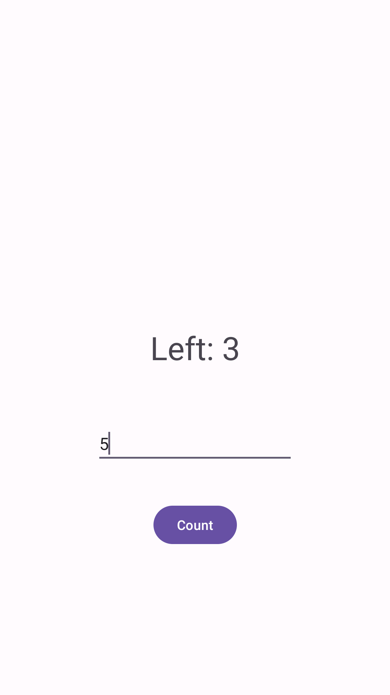

# CountDownTimer App

This Android application is a CountDownTimer that allows the user to input a duration in seconds. The timer counts down and alerts the user with both a sound and a dialog when the time is up.

## Features

- Set a custom countdown duration in seconds.
- Receive both an audible alert and a dialog notification when the countdown finishes.

## Usage

1. Clone the project to your computer or download it as a ZIP file.

    ```bash
    git clone https://github.com/josephnade/CountDownApp.git
    cd countdown-timer
    ```

2. Open the project in Android Studio or another suitable Android development environment.

3. Run the application on an Android device or emulator.

4. Enter the desired countdown duration in seconds.

5. Press the "Start" button to initiate the countdown.

6. When the countdown reaches zero, an audible alert will play, and a dialog notification will appear.

## Screenshots




## Technologies

- Java
- Android Studio


